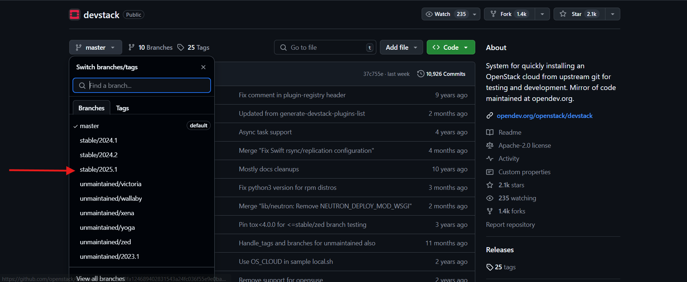

<h1 align="center">🚀 آموزش نصب DevStack  <code>[Stable]</code></h1>
<p align="center">
  
</p>
<p align="center"><i>مخزنی برای نصب، پیکربندی و رفع اشکال DevStack با تجربه عملی</i></p>

---

> 💡 توصیه: DevStack را در یک ماشین مجازی یا محیط ایزوله نصب کنید تا از آسیب به سیستم اصلی جلوگیری شود.

---

## 🗂️ ساختار فایل‌ها
| فایل                                                         | توضیح                                                    |
| ------------------------------------------------------------ | -------------------------------------------------------- |
| [`Openstack`](docs/Openstack.md)                             | معرفی اولیه OpenStack و متد‌های تست آن                   |
| [`How-to-install-Devstack`](docs/How-to-install-Devstack.md) | مراحل نصب DevStack با فایل کانفیگ                        |
| [`install-python-3.10`](docs/install-python-3.10.md)         | روش نصب پایتون ۳.۱۰ بدون مشکل ناسازگاری                  |
| [`Stable-devstack`](docs/Stable-devstack.md)                 | حل سه مانع اصلی پایداری Devstack                         |
| [`disk-image-format`](docs/disk-image-format.md)             | معرفی سیستم‌عامل‌ها و فرمت‌های مناسب آن‌ها برای Devstack |
| [`Terms`](docs/Terms.md)                                     | اصطلاحاتی که آشنایی با آن‌ها مهم است                     |
| [`scripts/`](scripts/)                                       | حاوی فایل local.conf پیشنهادی                            |
| [`assets/`](assets/)                                         | حاوی فایل تصاویر و ...                                   |
---

## 📋 پیش‌نیازهای سیستم

| مورد                  | شرح                                                          |
|-----------------------|--------------------------------------------------------------|
| سیستم‌عامل           | Ubuntu 22.04 یا معادل                                        |
| دسترسی                | حساب کاربری با دسترسی sudo                                   |
| رم                    | حداقل 8 GB (ترجیحاً 16 GB)                                   |
| فضای دیسک            | حداقل 20 GB فضای آزاد                                        |
| ابزارها               | Git, curl, Python 3                                          |
| شبکه                  | اتصال اینترنت پایدار (VPN یا DNS در صورت نیاز)               |

---

## ⚙️ مراحل نصب DevStack

<details>
<summary>1. ایجاد کاربر <code>stack</code> با دسترسی sudo</summary>

```bash
sudo useradd -s /bin/bash -d /opt/stack -m stack
sudo chmod +x /opt/stack
echo "stack ALL=(ALL) NOPASSWD: ALL" | sudo tee /etc/sudoers.d/stack
sudo -u stack -i
```
</details>

<details> <summary>2. به‌روزرسانی بسته‌ها</summary>

```bash
sudo apt-get update && sudo apt-get upgrade -y
```
⏳ ممکن است ۱۰–۱۵ دقیقه طول بکشد. </details>

<details> <summary>3. نصب Git</summary>

```bash
sudo apt-get install -y git
```
</details>

<details> <summary>4. کلون کردن مخزن DevStack</summary>

```bash
git clone https://github.com/openstack-dev/devstack.git
cd devstack
```
🔀 برای شاخه پایدار:

```bash
git clone -b <branch_name> https://github.com/openstack-dev/devstack.git
```
<p align="center">  </p> </details>

<details> <summary>5. پیکربندی <code>local.conf</code></summary>

```bash
touch local.conf
nano local.conf
```
# یا با VSCode:
code local.conf
سپس محتوای پیشنهادی در scripts/local.conf را پیست و ویرایش کنید. </details>

<details> <summary>6. اجرای نصب</summary>

```bash
./stack.sh
```
🔧 زمان اجرا بسته به اینترنت و سخت‌افزار ۲۰–۴۵ دقیقه است. </details>

🌐 دسترسی به رابط وب
پس از پایان نصب، اسکریپت آدرس IP و پورت‌ها را نمایش می‌دهد. در مرورگر:

- IP گزارش‌شده را وارد کنید
- یا آدرسی که در local.conf ست کرده‌اید را استفاده کنید

🧯 رفع مشکلات متداول برای حل ارورها و مشکلات زیر به فایل [`Stable-devstack`](docs/Stable-devstack.md) مراجعه کنید:

1. LVM و Loop Device 

2. پایداری 

3. تنظیمات شبکه 

4. دیگر مشکلات رایج 

📚 منابع تکمیلی
🔗 مستندات رسمی DevStack

🔗 راهنمای نصب OpenStack

<p align="center">Made with ❤ by <strong>Beazyat</strong></p>
